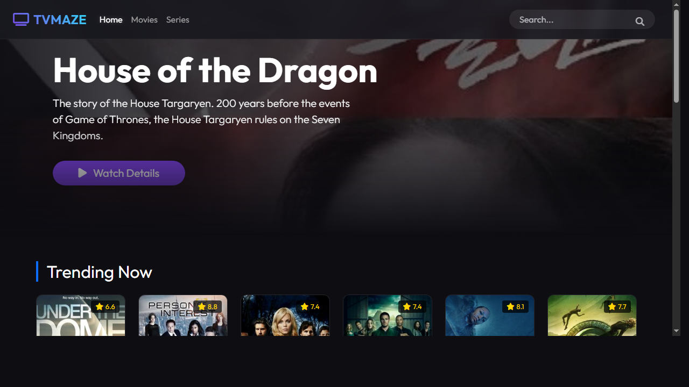
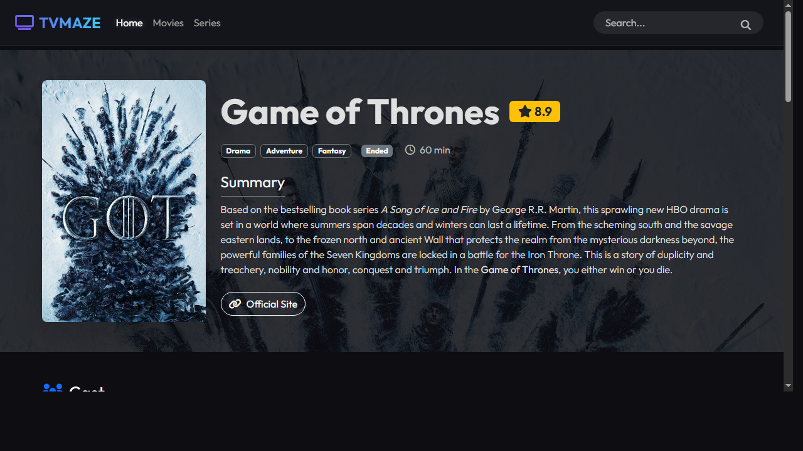

# 📺 TVMaze Streaming App


Uma interface de aplicativo de streaming moderna e profissional construída com **PHP**, seguindo o padrão arquitetural **MVC (Model-View-Controller)**. Este projeto demonstra padrões de código de alta qualidade (PSR-4/PSR-12), integração robusta de API com o [TVMaze](https://www.tvmaze.com/api) e um design de UI/UX de ponta inspirado nas tendências de streaming de 2025/2026.

---

## 📖 Índice
- [Sobre o Projeto](#-sobre-o-projeto)
- [Principais Funcionalidades](#-principais-funcionalidades)
- [Arquitetura e Design](#-arquitetura-e-design)
- [Pré-visualizações](#-pré-visualizações)
- [Começando](#-começando)
- [Instalação](#-instalação)
- [Estrutura do Projeto](#-estrutura-do-projeto)
- [Licença](#-licença)

---

## 🚀 Sobre o Projeto

O **TVMaze Streaming App** é uma aplicação pronta para portfólio, projetada para mostrar habilidades avançadas de desenvolvimento em PHP. Ele transforma dados brutos da API do TVMaze em uma experiência de streaming imersiva e amigável ao usuário.

Diferente de scripts PHP procedurais antigos, esta aplicação roda em um **Núcleo MVC** personalizado, roteando requisições de forma eficiente e separando a lógica de negócios da apresentação.

---

## ✨ Principais Funcionalidades

### 🏗️ Técnico
*   **Arquitetura MVC**: Framework leve personalizado com Roteador, Controller Base e motor de View.
*   **Conformidade PSR**: Totalmente compatível com o autoloading PSR-4 e padrões de codificação PSR-12.
*   **Camada de Serviço**: Classe `TVMazeService` robusta que lida com endpoints da API (Séries, Busca, Temporadas, Elenco, Equipe) usando streams nativos do PHP para máxima portabilidade (sem dependências externas de CURL).
*   **Segurança**: Implementa validação de entrada, escape de saída (proteção XSS) e manuseio seguro de parâmetros.

### 🎨 UI/UX (Estética 2025/2026)
*   **Design Glassmorphism**: Cabeçalhos e cartões modernos e translúcidos com desfoque de fundo.
*   **Modo Escuro Nativo**: Otimizado para consumo de mídia com acentos neon de alto contraste.
*   **Cards de Temporada Interativos**: Um padrão de UI único que permite aos usuários navegar visualmente pelas temporadas.
*   **Acordeões de Episódios**: Detalhes de episódios expansíveis com resumos, evitando sobrecarga de informações.
*   **Responsividade**: Layout totalmente fluido usando Grid do Bootstrap 5.3+, funcionando perfeitamente em Mobile, Tablet e Desktop.
*   **Micro-interações**: Efeitos suaves de hover, transições e toggles de "Ver Mais" para Elenco/Equipe.

---

## 🛠️ Arquitetura e Design

O projeto é organizado para manter a lógica e a apresentação distintas:

*   **`app/Core`**: O coração do framework (`Router`, `Controller`).
*   **`app/Controllers`**: Lida com a entrada do usuário e orquestra a recuperação de dados (`HomeController`, `ShowController`).
*   **`app/Services`**: Encapsula a lógica de API externa (`TVMazeService`).
*   **`app/Views`**: Templates PHP simples que renderizam a interface HTML.
*   **`public/`**: A raiz web, servindo assets e o script de entrada.

---

## 📸 Pré-visualizações

### Dashboard
> *Descubra séries em alta com um layout de grid elegante.*


### Detalhes da Série e Seleção de Temporada
> *Cards de Temporada Interativos e Listas de Episódios.*


---

## 🏁 Começando

### Pré-requisitos
*   **PHP 8.0** ou superior.
*   **Composer** (para autoloading).
*   Um servidor local (XAMPP, WAMP, Docker ou servidor embutido do PHP).

### Instalação

1.  **Clone o Repositório**
    ```bash
    git clone https://github.com/AndersonC96/TVmaze_PHP.git
    cd TVmaze_PHP
    ```

2.  **Instale as Dependências**
    Atualmente, o projeto usa o Composer principalmente para autoloading.
    ```bash
    composer install
    ```

3.  **Execute a Aplicação**
    Você pode usar o servidor embutido do PHP para um início rápido:
    ```bash
    php -S localhost:8000 -t public
    ```

4.  **Acesse**
    Abra seu navegador e navegue para `http://localhost:8000`.

---

## 📂 Estrutura do Projeto

```text
TVmaze_PHP/
├── app/
│   ├── Controllers/   # Manipuladores de Requisição
│   ├── Core/          # Lógica do Framework (Roteador)
│   ├── Services/      # Clientes de API
│   └── Views/         # Templates HTML
├── public/            # Raiz Web
│   ├── css/           # Estilos Personalizados
│   ├── js/            # Scripts de Interatividade
│   └── index.php      # Ponto de Entrada
├── vendor/            # Dependências do Composer
├── composer.json      # Config do Projeto
└── README.md          # Documentação
```

---

## 📄 Licença

Este projeto está licenciado sob a **Licença MIT**. Sinta-se à vontade para usar, modificar e distribuir para fins pessoais e educacionais.

---

<p align="center">
    Construído por [Anderson Cavalcante](https://www.linkedin.com/in/andersoncavalcante96/)
</p>
